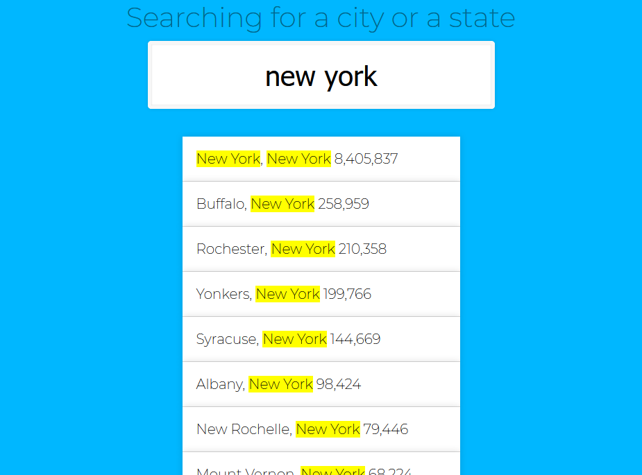
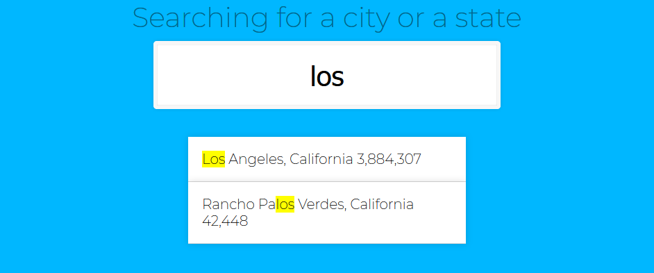

# JavaScript exercise

## Directory structure

- css/
  - main.css
  - main.css.map
- images/ (just ignore it)
- js/
  - data.js (contain an array of objects, each object holds information about cities in US)
  - main.js (in this file comes your code)
- scss/
  - main.scss (style using scss)
- index.html (don't change this file)
- README.md
- .gitignore
- LICENSE

## Tasks

create a js program that when a user type something or change the input in the form update immediately the list (.suggestions) to display a list of the cities or state that match the typed value. each item in the list should hold this information city, state and population

**Examples:**

_Example 1_

_Example 2_

